<div align="center">


# PayGuard

### Check before you pay. Check before you click. Check before you install.

**An explainable anti-fraud shield for India's digital payments: it checks UPI QR codes and links, "I've paid"
screenshots, SMS / WhatsApp messages and Android apps, and tells you *why* something is a scam, in your language.**

[](https://github.com/paulnimisha11-png/payguard-latest/actions/workflows/backend.yml)
[](https://github.com/paulnimisha11-png/payguard-latest/actions/workflows/android.yml)


[](ruff.toml)


-3DDC84?logo=android&logoColor=white)

[](LICENSE)

**[🌐 Live demo](https://payguard-api-9w9d.onrender.com)** ·
**[📱 Android APK](https://github.com/paulnimisha11-png/payguard-latest/releases/tag/android-latest)** ·
**[🎬 3-minute demo video](DEMO_VIDEO_URL)** ·
**[📖 API docs (Swagger)](https://payguard-api-9w9d.onrender.com/docs)** ·
**[🔬 Feature reference](docs/FEATURES.md)**

<sub>ASYNC'26 · Track 3: Cybersecurity & Defense · the live demo runs on a free server: the first request after a
quiet period can take ~30–60 s while it wakes up.</sub>

</div>

---

## Table of contents

1. [Context & overview](#1-context--overview): [problem](#the-problem) · [what PayGuard does](#what-payguard-does) · [inside the scanners](#inside-the-four-scanners) · [around the scanners](#around-the-scanners) · [why it's different](#why-its-different) · [screenshots](#demo-screenshots--media)
2. [Architecture & system design](#2-architecture--system-design): [system diagram](#system-architecture) · [execution flows](#end-to-end-execution-flows) · [docs](#documentation-links)
3. [Installation & configuration](#3-installation--configuration): [prerequisites](#prerequisites--tech-stack) · [install](#step-by-step-installation) · [environment variables](#environment-variables-matrix)
4. [Developer experience & quality control](#4-developer-experience--quality-control): [usage snippets](#usage-snippets) · [testing & QA](#testing--qa-commands)
5. [Reliability, performance & security](#5-reliability-performance--security): [benchmarks](#benchmarks--maturity-status) · [troubleshooting](#troubleshooting--known-limitations) · [security](#security-reporting)
6. [Governance & license](#6-governance--license)

---

## 1. Context & overview

### The problem

India runs on UPI, and scammers have learned to attack the moment of payment rather than the bank:

- a **QR code "to receive your refund"** that actually takes money out of your account;
- an **SMS** saying your account will be blocked tonight unless you "update KYC" on a look-alike website or share an OTP;
- a customer who shows an **edited "payment successful" screenshot** and walks away with the goods;
- an **APK** sent on WhatsApp as a "courier update" or "electricity bill" that silently reads every OTP.

Every one of these works the same way: it rushes you into acting before you can check. Existing protection is either
invisible (bank back-ends), too technical (antivirus jargon), or a black box that says "scam" without saying why.
The people hit hardest, such as parents, small shopkeepers and first-time smartphone users, are the ones least able to
judge a URL or a permission list.

### What PayGuard does

PayGuard gives you a **pause and a clear answer** at the four places scams happen. One website (installable as an app)
and one Android app share the same engine:

| | Scanner | You give it | You get |
|---|---|---|---|
| 🔳 | **PayPause: QR / UPI** *(core)* | A QR image, the camera, or a `upi://` / web link. On Android PayGuard can sit **between any `upi://` link and your UPI app** | Who really gets the money, how much, whether it leaves *your* account, a calibrated **ML scam probability**, and a one-tap hand-off to GPay / PhonePe / Paytm when it's safe |
| 🧾 | **Payment screenshot forensics** | The "I've paid" screenshot | **VERIFIED / SUSPICIOUS / UNVERIFIED**, the fields it read (amount, UPI ID, UTR, time, status), edited areas boxed in red, and every check it ran |
| 💬 | **SMS / WhatsApp scam checker** | A pasted or shared message (+ sender, if known) | **HIGH / MEDIUM / LOW / MINIMAL** risk from a 6-layer pipeline: rules, link analysis, sender, Scam Memory, threat intelligence, and AI only when unsure |
| 📦 | **APK X-Ray** | An `.apk` someone sent you | What the app can do to your phone *before* you install it: banking-trojan fingerprints, OTP theft, fake login pages, who signed it |

### Inside the four scanners

Each scanner follows the same contract: **deterministic checks first, every finding comes with its evidence, and the
result says plainly what it can't know.** Here is what each one actually does.

#### 🔳 PayPause: QR codes and UPI links *(core feature)*

**The scams it stops.** The most common UPI frauds don't hack anything: they make *you* approve a payment.
- *"Scan this QR to receive your refund / prize / OLX payment"*: scanning a UPI QR can only ever **send** money.
- **Collect requests** and **AutoPay mandates** hidden behind a "verification" step.
- QR codes whose payee name says *SBI Refund Dept* or *Paytm KYC Team* while the money goes to a personal account like `9876501234@ybl`.
- Tampered or malformed links (`upi:\pay?…`, duplicate `pa=` fields, broken amounts) that some apps still open.
- QR codes that aren't payments at all: fake bank websites, APK download links, `sms:` codes that bind your SIM, `tel:` codes that dial USSD call-forwarding (`*21*…`), rogue Wi-Fi joins.

**How it works.**
1. **Decode.** OpenCV reads the QR from an upload, a pasted screenshot or the live camera, trying several image variants (grey, thresholded, inverted, upscaled) so photographed or low-contrast codes still decode.
2. **Strict UPI validation.** The link must be exactly `upi://pay|collect|mandate?pa=name@handle&…` with valid amount and currency. Anything that merely *looks* like UPI is still parsed, and a malformed link is **never marked safe**; the exact problems are listed.
3. **Rules.** About 25 checks: receive-money lures in the note or name, collect / AutoPay, official-sounding name on a personal account, unusual UPI handles, large amounts, phone numbers hidden in the note; and for web links, look-alike brand domains, punycode, `@` tricks, raw IP hosts, shorteners, throw-away domains, bait words, missing https and APK downloads.
4. **Scam Memory.** Has anyone reported this UPI ID, or a look-alike "mutation" of a reported one (`sbi.refund@ybl` → `sbi-refunds@ybl`, `sb1-refund@ybl`)? Look-alike characters and separators are folded before comparing, while IDs that differ only in digits (`ravi.kumar1` / `ravi.kumar2`) are treated as different people.
5. **ML model.** 36 features from the parsed payment (handle type, digit patterns, payee/note wording, amount shape, merchant codes, community reports…) go into gradient-boosted trees, then isotonic calibration. The output is a **scam probability between 1% and 99%** and the signals that moved it.
6. **Safety floor.** The ML estimate sets the verdict, but it can never drop below what hard evidence demands: a malformed link, hidden AutoPay or real community reports always win.

**What you see.** Who actually receives the money, how much, and a bold *"this takes money OUT of your account"* when that's the case. The ML estimate is shown with the reasons that moved it ("payee name uses refund words ▲ towards scam"). When the code is clean, a **3-second countdown hands the payment to GPay, PhonePe, Paytm or BHIM**, pre-filled. Risky codes never auto-open: paying anyway needs an explicit "I know this person" tick, and that can alert family.

**On Android, it's a gatekeeper, not a scanner you have to remember.** The PayGuard app can register as the phone's handler for `upi://` links. Any payment link from the camera, Google Lens, WhatsApp or a merchant app reaches PayGuard first. Safe ones are forwarded to your real UPI app in one tap; scams stop on a full-screen warning.

**Try it:** `samples/qr/scam_refund_upi.png` → *Do NOT pay*, ML ≈ 97%. `samples/qr/genuine_shop_upi.png` → low risk, straight to your UPI app.

**Honest limits:** the ML model is a labelled **prototype** trained on a documented synthetic dataset (there is no public labelled UPI-fraud data). A genuine-looking QR from a real but dishonest person can't be detected from the code alone; the payee name your UPI app shows is still the final check.

#### 🧾 Payment screenshot forensics

**The scam it stops.** A buyer shows a *"Payment successful"* screenshot and leaves with the goods, but the screenshot was edited (amount changed, digit added), reused from an old payment, shows a *pending* payment, or was generated by a fake-payment app. Small shopkeepers and online sellers lose money this way every day.

**How it works.** Twelve groups of checks, each reported separately:
- **File evidence:** photo-editor software or edit history hidden in EXIF / PNG / XMP metadata, photo-of-a-screen, odd crops.
- **OCR at a fixed 1080 px width, with extra reading passes.** It reads the amount, payee, UPI ID, 12-digit UTR, app transaction ID, date and time, and status. The extra passes are what catch a digit that was painted over.
- **Pixel forensics on each field OCR found:** a patched background behind the text, a different font weight or style for the same-size text, digits that aren't rendered the way a phone renders them, and error-level analysis for JPEGs. Suspicious areas are **boxed in red** on the image.
- **Consistency:** pending / failed status, missing or malformed UTR, an app transaction ID whose embedded date and minute contradict the time printed, impossible dates (31 Feb) or future dates, two different amounts on one receipt, amount vs what you expected.
- **QR on the image:** if the receipt contains a payment QR, it is parsed with the same strict UPI parser and compared with the receipt (different payee or amount = tampering).
- **History:** the same UTR on a different-looking screenshot, or an edited copy of a receipt someone already checked. Recompressed WhatsApp copies of the *same* image are recognised and not counted.
- **Your bank SMS (optional):** paste the credit SMS and it is matched against the screenshot.

**What you see:** one of three statuses, chosen deliberately:

| Status | Meaning |
|---|---|
| **SUSPICIOUS** | Tampering or inconsistency found. The reason names the most important one. Don't hand over goods. |
| **UNVERIFIED** | The screenshot is internally consistent and shows no signs of editing, **but a screenshot can't prove a payment**. Check your own bank or UPI app for the reference number shown. |
| **VERIFIED** | Only when a trusted transaction source (a real, authenticated bank or payment-gateway integration) confirms the payment. The hook exists (`verify.TRUSTED_SOURCES`); none is connected, so PayGuard never claims this today. |

Alongside the status: the extracted fields, the issues found, and the full list of checks with pass / fail / warning / skipped.

**Try it:** `samples/screenshots/fake_edited_amount.png` → SUSPICIOUS; `genuine_receipt.png` → UNVERIFIED.

**Honest limits:** a perfect forgery that regenerates the entire screen can pass pixel checks; that's exactly why a clean result is *UNVERIFIED*, never "genuine". OCR on very low-resolution or photographed screens is less reliable, and the result says so.

#### 💬 SMS / WhatsApp scam checker

**The scams it stops.** Thirteen Indian scam scripts, in English, Hindi (Devanagari and Hinglish) and Kannada:
- electricity cut-off, KYC / account block, SIM block;
- parcel / customs fee, e-challan, FASTag;
- refund / prize, "sent money to you by mistake";
- part-time job / task scams, instant loans, investment schemes;
- "digital arrest" by fake police or CBI, and *"hi mum, this is my new number"*.

It also catches what the message wants you to *do*: share an OTP or PIN, enter your PIN to "receive" money, install AnyDesk or an APK, call a personal mobile number, pay a fee, join a video call, keep it secret.

**How it works: six layers, cheapest first.**
1. **Extraction.** Every link is found with regular expressions and `urllib.parse`; **nothing is ever opened**. Disguised links are recovered (`hxxp://`, `site[.]com`, invisible characters, bare IP addresses) and look-alike Unicode domains are converted to the real address the browser would visit. Phone numbers, UPI IDs and amounts are extracted too.
2. **Rules.** A topic alone is only a hint ("your electricity bill is due" stays low); **topic + a dangerous request is the scam**. Sentence-level negation means a genuine OTP message ("do not share this code") isn't flagged.
3. **URL analysis.** The QR scanner's link checks, plus misspelled brand domains (edit distance and look-alike characters: `hdfcbnak.com`, `amaz0n-gifts.in`), IPs written as one long number, odd ports, redirect parameters, heavy encoding, executable downloads and long hyphenated domains.
4. **Sender.** A registered DLT header (`VM-SBIINB-S`) vs a personal or foreign number vs the organisation the text claims to be. *"SBI" writing from `+91 98…`* is a strong signal; a header from a different company is a mismatch.
5. **Scam Memory + threat intelligence.** The sender, domains, numbers, UPI IDs and even the message's wording template are checked against community reports, then links against Google Safe Browsing (optional).
6. **AI, only if still unsure.** Gemini Flash reads a **masked** copy (numbers, UPI IDs and e-mails hidden, links reduced to the website name) and returns structured signals: impersonation, credential or payment request, pressure tactics. It can add at most 25 points, never lowers a score, and can't make a message HIGH risk on its own. Identical messages are answered from a cache, so a viral scam costs one AI call.

**What you see:** HIGH / MEDIUM / LOW / MINIMAL risk; the factors and which layer found each one; the sender check; the links; the Scam Memory and threat-intel results; a short AI explanation when it was used; what to do now; and the status of every layer (ran, skipped, unavailable). Dangerous phrases are highlighted inside the message itself.

**Try it:** *"Dear customer your SBI account will be blocked today. Update KYC at http://sbi-kyc-update.xyz/login and share the OTP"* with sender `+919876543210` → HIGH: OTP request, dangerous link, known scam script, bank claim from a personal number. The AI isn't needed.

**Honest limits:** brand-new scam domains aren't listed anywhere yet; link redirects aren't followed; sender IDs can be spoofed; carefully worded scams can pass the rules. Each limit is covered by another layer, and none is hidden from the user.

#### 📦 APK X-Ray

**The scam it stops.** *"Courier delivery update.apk"*, *"Electricity bill.apk"* or *"SBI KYC.apk"* sent on WhatsApp. Once installed, these banking trojans read every OTP, draw fake login screens over your bank app, forward your calls and upload everything to a Telegram bot. PayGuard looks inside the file **without installing or running it**.

**How it works.**
1. **Safe unpacking:** size, entry-count and zip-bomb checks; split bundles (`.apks`, `.xapk`) unwrapped.
2. **Manifest:** androguard decodes the binary `AndroidManifest.xml`: permissions, services, receivers, accessibility services, SDK levels.
3. **Code:** a custom DEX reader pulls every string and every referenced Android API in milliseconds (SMS parsing, `content://sms`, overlay windows, device admin, call control…).
4. **Resources and assets:** built-in phishing forms (CVV / ATM PIN / MPIN fields), hidden APK or DEX payloads, packers.
5. **Signature:** unsigned, debug-signed or freshly signed apps.
6. **24 rules**, including the **banking-trojan triad** (read SMS + accessibility + draw over apps), OTP theft, Telegram exfiltration, call forwarding (`*21*`), Indian bank target lists, brand impersonation (name says *SBI* but the package isn't SBI's), scam-lure mismatch (a "courier" app that wants your SMS), hidden icon, dropper behaviour, default-SMS takeover and old target SDKs that skip permission prompts.

Everything runs in a short-lived **worker process with a timeout**, so a hostile file can't take the server down. The file is deleted after the scan; only the report is kept, cached by SHA-256, so an APK going viral is analysed once and the report says *"this exact file has been checked N times"*.

**What you see:** a 0–100 risk score and verdict ("Do NOT install this app"); the trojan triad as three cards; "what a real courier app needs vs what this one asks for"; every finding with its evidence; optionally a VirusTotal hash lookup and a Gemini explanation written from the extracted facts (never the file). Read-aloud and "send to family on WhatsApp" buttons sit on the result.

**Try it:** `samples/Courier_Delivery_Update.apk` (an inert fixture we built) → **100 / 100**.

**Honest limits:** static analysis can't see code downloaded after install or hidden by commercial packers (packers are flagged instead). Legitimate SMS apps and screen readers need the same permissions, which is why every finding shows its evidence and "low risk" is never presented as "safe".

#### Around the scanners

The scanners answer "is *this* a scam?". The features around them turn a single check into protection for the next
person, a warning to the family, and evidence for the police.

##### 🧠 Scam Memory: community reports + your own history

**What it does.** After any check, one tap says **"It got me — I lost money"** or **"It's fake — I spotted it"**.
The next person who checks the **same UPI ID, phone number, website, screenshot or APK**, anywhere, sees
*"Already reported by N people"* and a raised risk score. Separately, the **"My scams"** page keeps *your own* history
on your device: if a new message or QR looks like one you dealt with before, PayGuard says so.

**How it works.**
- Each report stores **only the scammer's identifiers** (UPI ID, domain, phone number, message-wording template, file hash), never the victim's message or screenshot.
- **Look-alike matching** also catches *mutations* of a reported ID (`sbi.refund@ybl` → `sbi-refunds@ybl`), using edit distance plus character-pair overlap, with look-alike characters folded first. For APKs, a behaviour fingerprint catches repackaged copies of a flagged app.
- Scoring is deliberately cautious: **1 report = caution, 2 = high, 3+ = critical**. Disputed indicators ("this is genuine") are shown but not counted.
- The on-device history is stored in the browser's `localStorage` as patterns only (identifiers, scam type, tricks) and never leaves the phone.

**Protection against false or malicious reports.**
- Each device sends a random ID that is **hashed with a server-side salt**, so one phone counts once and nobody can be identified.
- Reports also carry a salted **network hash**, so 50 reports from one Wi-Fi network don't look like 50 victims.
- Official bank and government websites **can't be reported**.
- Moderators can approve, hide or clear any identifier from `/admin.html`. Clearing also removes the warning from future scans.

**Tech:** FastAPI endpoint `POST /api/reports`, SQLite `votes` + `indicators` tables, salted SHA-256 hashing, Levenshtein + bigram-Jaccard similarity (`app/analyzer/mutation.py`), browser `localStorage` (`static/memory.js`).

##### 👨‍👩‍👧 Family guardian mode

**What it does.** Scammers target parents and grandparents who won't ask for help in time. A son or daughter becomes
their **guardian**: whenever the protected phone gets a **dangerous or suspicious result** on any scanner, or the parent
taps **"pay anyway"** on a risky QR, every guardian gets an alert within seconds. The parent's own result screen shows
*"Talk to Rahul before you pay — 📞 Call"*.

**How it works.**
- **Pairing:** the guardian creates a **6-digit code** (random, valid for 15 minutes). The parent types it and confirms what will be shared. Wrong guesses are rate-limited per IP.
- **No accounts or passwords:** each phone holds a random device secret, and the server stores only its SHA-256. It is sent as an `X-PG-Device` header, so alerts are raised **on the server**, not by a page that could be closed.
- **Delivery, three ways:**
  - an in-app inbox;
  - **Web Push** to Chrome on Android and to the iPhone home-screen app (iOS 16.4+);
  - the Android app's own notifications, checked every 15 minutes and whenever the app opens.
- **Privacy:** an alert contains the scam type and a **masked** identifier (e.g. `98••••••10`), never the message or screenshot. Alerts auto-delete after **30 days**; either side can unlink; "Forget this phone" erases everything.

**Tech:** `app/family/` (pairing, alerts, `fam_*` SQLite tables), our **own Web Push implementation** (`app/family/push.py`: VAPID JWT signing + RFC 8291 `aes128gcm` payload encryption with `cryptography`, no third-party push service), service worker (`static/sw.js`), Android `JobScheduler` (`AlertJobService.java`).

##### 🚨 One-tap complaint

**What it does.** After a scam, the first hour matters: reporting to **1930** quickly can freeze the money. People lose
that hour working out *what* to say. **"Report this scam"** asks a few questions (money lost? amount, UTR, bank, when,
how it arrived) and returns everything ready to file:
- **Fields for cybercrime.gov.in** with a copy button on each: category, sub-category, time, platform, amount, UTR, beneficiary, suspect identifiers, and a 200+ character description.
- **What to say on the 1930 call**, in English, Hindi or Kannada, filled with the amount, UTR, beneficiary and time.
- **A next-step checklist**, urgent steps first: 1930, block the bank card / UPI, uninstall the app, file on the portal, report the number on Chakshu, keep the evidence.
- **An evidence PDF (A4):** summary, suspect identifiers, transaction details, the regenerated QR or file hashes, findings with evidence, the victim's statement, and an evidence fingerprint.
- A reference number (`PG-YYMMDD-XXXXXX`) and a private link to come back later.

**How it works.**
- The server **re-derives the evidence from the original scan**; it never trusts findings sent by the browser.
- Each complaint is protected by a random access token. It is shown once, and only its SHA-256 is stored.
- Complaints **auto-delete after 30 days**, and the user can delete theirs immediately.
- Scammer identifiers are kept separately with no victim data, which feeds Scam Memory.

**Tech:** `app/complaints/` (Pydantic validation, portal field builder, multilingual call script), **ReportLab** for the PDF, `qrcode` to regenerate the scanned QR inside the evidence.

PayGuard can't submit to the government portal itself (there is no public filing API), so it makes filing a
copy-paste job of a few minutes.

##### 📡 Public scam radar (`/trends`)

**What it does.** A public page showing what PayGuard users are checking and reporting:
- checks and scams caught this week vs last week;
- a **14-day chart**;
- **rising scam types** (e.g. "electricity cut-off messages up this week");
- the **most-reported UPI IDs, phone numbers and websites**.

Anyone can paste the exact UPI ID, number or website they were given and see whether it has been reported. This is
useful for awareness campaigns, journalists and cyber cells.

**How it works.**
- **Anonymous counters only:** day, scanner, verdict and scam type. No content, no IPs, no user IDs.
- An identifier is listed publicly only after **`APKXRAY_PUBLIC_MIN` (default 3) people report it from as many different networks**, and only while fewer than half as many say it's genuine.
- UPI IDs and phone numbers are **partly masked** (`98••••••10`, `sbi•••••ds@ybl`); websites are **defanged** (`sbi-kyc[.]xyz`) so they can't be clicked.
- `scripts/seed_demo.py` adds clearly labelled demo data for presentations (`--remove` deletes it). The page shows a banner whenever demo data is present.

**Tech:** `app/trends.py` (aggregation, public-listing rules, masking, lookup with a 30-second cache), SQLite `events` + `moderation` tables, a vanilla-JS chart with an accessible "show as table" view (`static/trends.html`, `trends.js`), moderation UI `static/admin.html`.

##### ♿ Accessible by design

**What it does.** The people most at risk are often the least comfortable with English or technical words, so every
result is written for them:
- **Interface in 7 Indian languages:** English, हिंदी, ಕನ್ನಡ, தமிழ், తెలుగు, मराठी, বাংলা, switchable from any page and remembered.
- **Findings, advice and the 1930 call script in English, Hindi and Kannada.** Every rule carries all three translations, not machine translation at runtime.
- **Plain language, no jargon:** "Scanning this sends ₹4,999 FROM your account", not "collect request detected". Colours, icons and the hooded sentinel figure (green / yellow / red) carry the verdict even before anything is read.
- **Read aloud:** uses the phone's own voice first, with a server fallback for languages the phone lacks.
- **"Send to family on WhatsApp":** a ready-to-send message explaining the scam in simple words, so the warning travels to the people who need it.
- **Install like an app, share like a message:** the website is an installable PWA. On Android, "Share → PayGuard" from WhatsApp or Messages sends a message or link straight to the right scanner.
- **Readable everywhere:** mobile-first layout, large tap targets, `prefers-reduced-motion` respected, screen-reader labels (`aria-live`) on results.

**Tech:** Web Speech API with an **eSpeak NG** server fallback (`/api/tts`, run locally as a subprocess; no third-party speech API), Web Share Target + service worker (PWA), family message from templates or, when `ANTHROPIC_API_KEY` is set, written naturally by Claude.

**Target audience:** everyday UPI users and their families, small merchants who accept UPI, and the cyber-cell /
bank-awareness teams who want explainable evidence rather than a bare "scam" label.

### Why it's different

| Principle | What it means in PayGuard |
|---|---|
| **Explainable, never a black box** | Every result lists its findings with the evidence behind them ("payee name says *SBI Refund Dept* but it's a personal account"). |
| **Deterministic first, AI last** | Rules, parsers, forensics and a calibrated ML model decide. Gemini is consulted **only when the result is ambiguous**, sees **masked** text, and its weight is capped. |
| **Honest about uncertainty** | Risk points are labelled "not a probability". The ML model is labelled *prototype*. A clean screenshot is **UNVERIFIED**, never "genuine", because only a bank can confirm a payment. |
| **Works when services fail** | No Gemini key, Safe Browsing down, no internet for the AI: every scanner still gives a full answer and says which layer was unavailable. |
| **Private by default** | Messages and screenshots are never stored; APKs are never installed or run and are deleted after the scan; keys never leave the server. |

### Demo screenshots & media

> 🎬 **[Watch the 3-minute demo video](DEMO_VIDEO_URL)** · try it yourself on the **[live demo](https://payguard-api-9w9d.onrender.com)** with the files in [`samples/`](samples/).

| Landing page | QR / UPI check with the ML scam estimate |
|---|---|
| 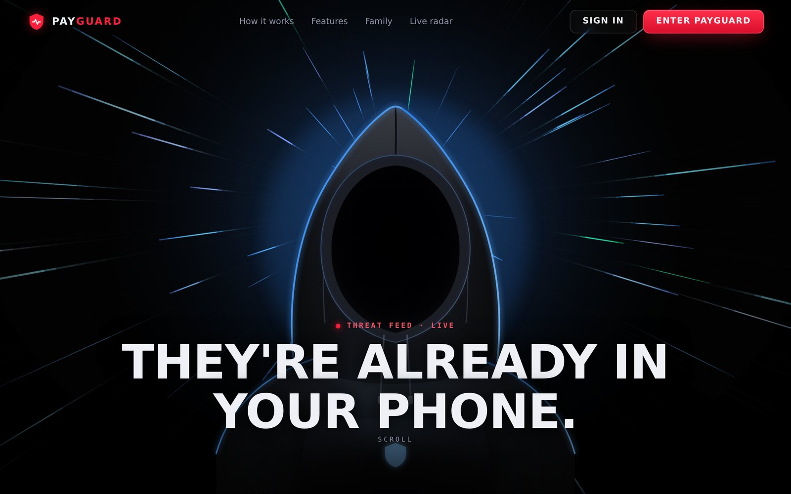 | 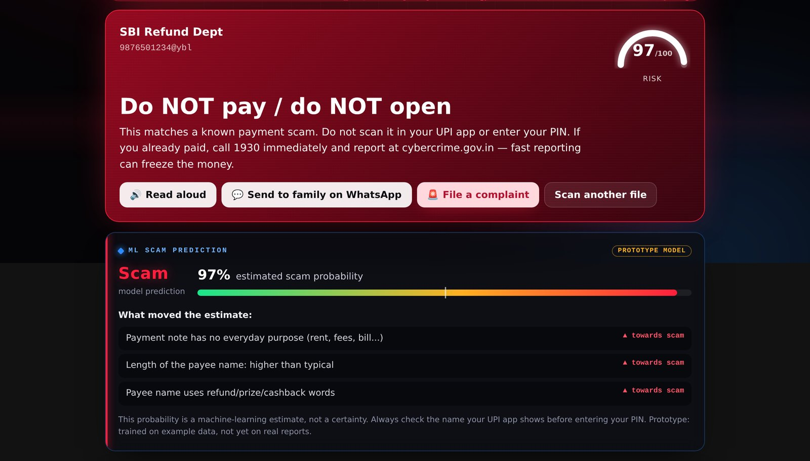 |
| **SMS pipeline: explainable risk card** | **Payment screenshot forensics** |
| 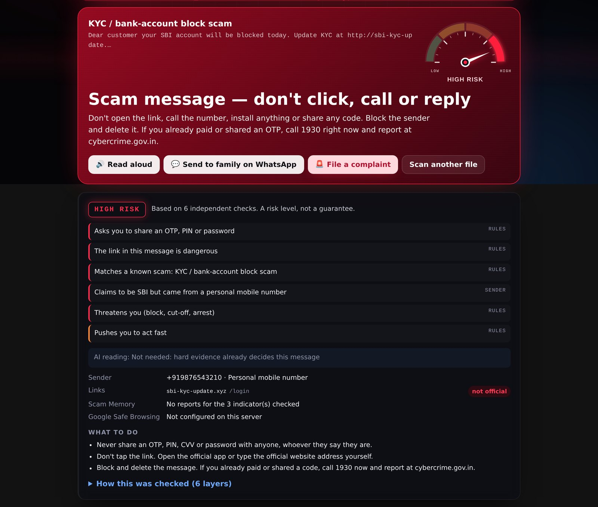 | 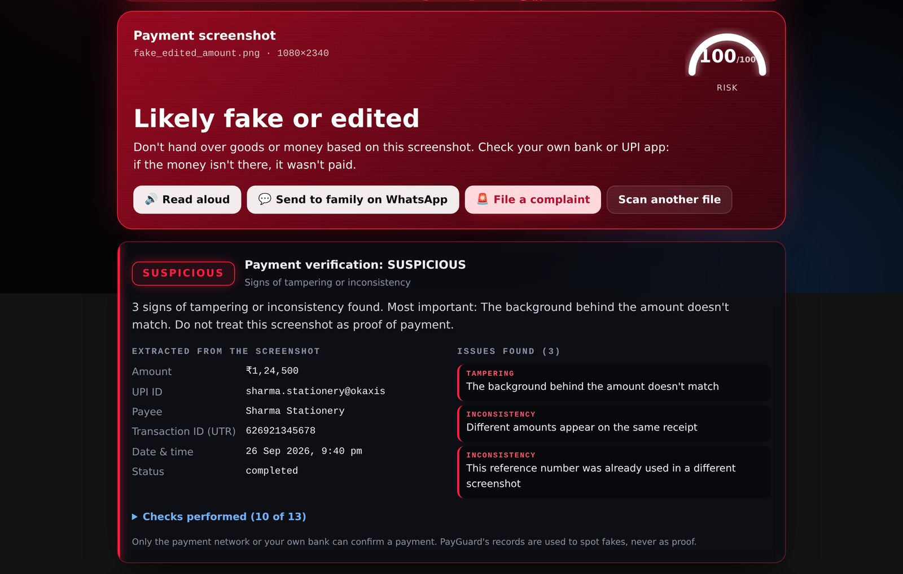 |
| **APK X-Ray: banking-trojan fingerprint** | **Scam radar (`/trends`, labelled demo data)** |
| 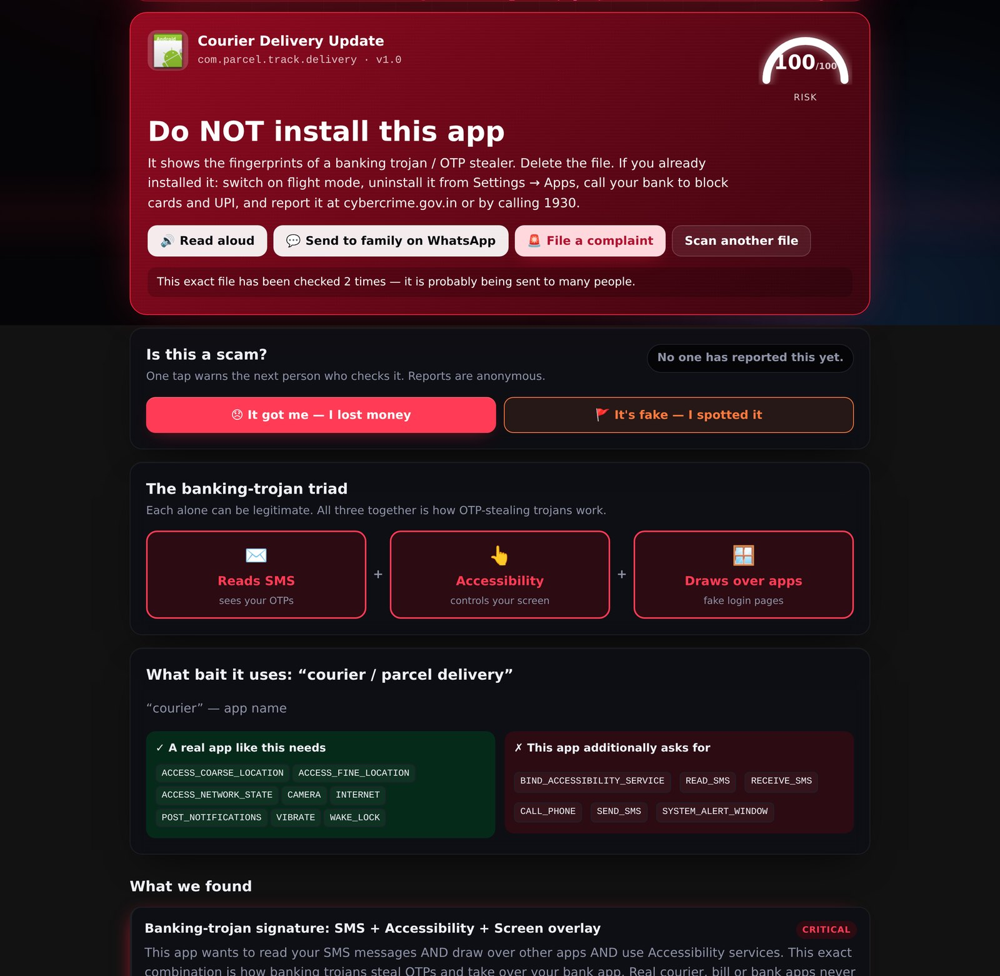 | 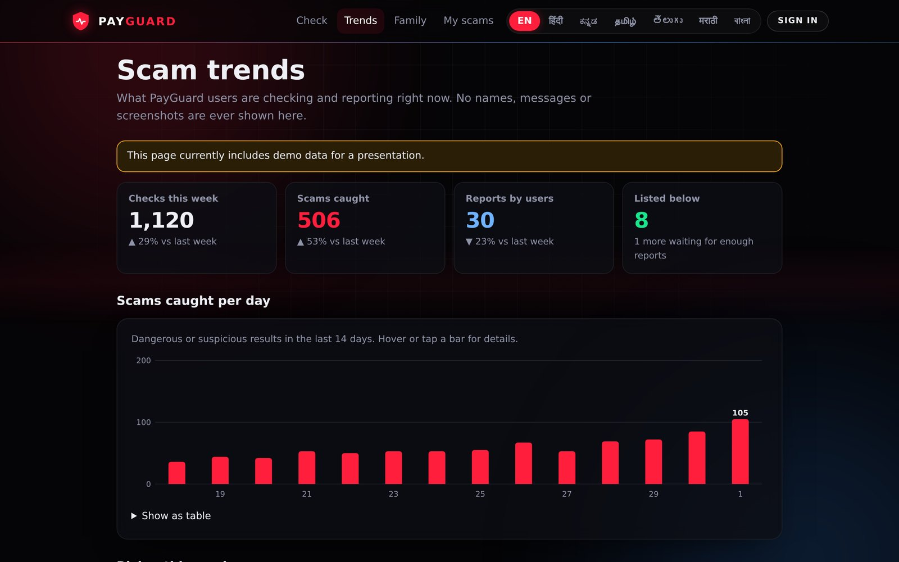 |

<details>
<summary><b>📱 Mobile view</b> (the whole web app is mobile-first and installable as a PWA)</summary>
<br/>
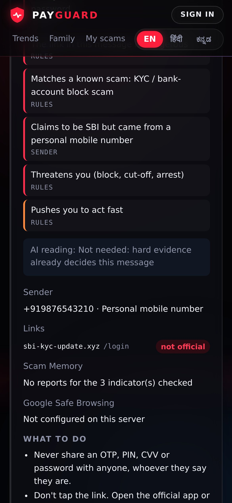
</details>

---

## 2. Architecture & system design

### System architecture

One FastAPI service serves the website, the JSON API and the Android app. Each scanner is a self-contained Python
package; every scan returns through one shared post-processing step (`_after_check`) that adds community evidence,
updates trends and raises family alerts. External services are optional and sit behind timeouts and fallbacks.

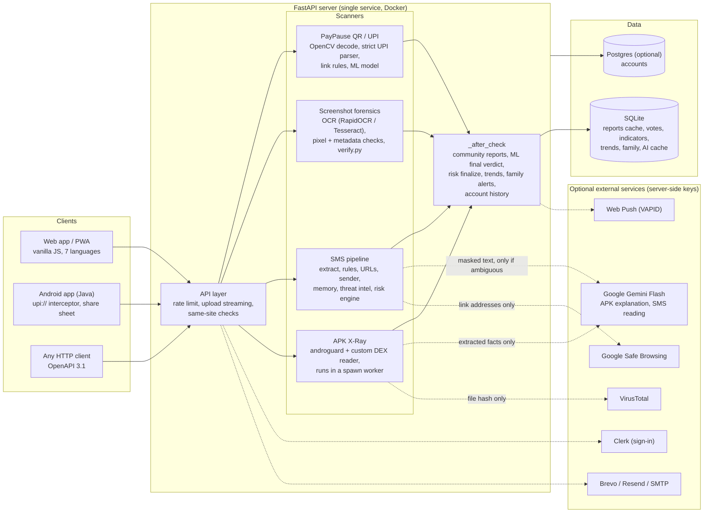

**Service boundaries.**

| Component | Code | Responsibility | Talks to |
|---|---|---|---|
| API layer | `app/main.py` | Routing, upload limits, rate limiting, pages, `_after_check` | all scanners, store |
| APK X-Ray | `app/analyzer/` | Zip safety → manifest → DEX strings/method refs → certificate → 24 rules | spawn worker (`worker.py`), Gemini (`reasoning.py`), VirusTotal |
| PayPause QR / UPI | `app/qr/`, `app/ml/` | QR decode, strict UPI validation, link rules, 36-feature gradient-boosted model with calibration | store (community), `complaints/community.py` |
| Screenshot forensics | `app/screenshot/` | OCR, field extraction, pixel forensics, consistency checks, VERIFIED / SUSPICIOUS / UNVERIFIED | store (UTR reuse, perceptual hashes) |
| SMS pipeline | `app/message/` | Extraction, rules, URL heuristics, sender, Scam Memory, threat intel, risk engine, gated AI | Safe Browsing, Gemini, store |
| Community & complaints | `app/complaints/`, `app/trends.py` | Votes, indicators, complaint builder + PDF, public trends, moderation | store |
| Family | `app/family/` | Device pairing, alerts, Web Push (own VAPID + aes128gcm) | browsers' push services |
| Accounts | `app/auth/` | Clerk session verification, sessions, check history, e-mail alerts | Clerk, Postgres/SQLite, e-mail provider |
| Web app | `static/` | Scanner UI, landing, trends, family, account; no build step | JSON API |
| Android app | `android-upi-intercept/` | `upi://` handler, QR camera, share target, native results | JSON API, UPI apps |

### End-to-end execution flows

#### A. Paying with a QR code on Android (the core flow)

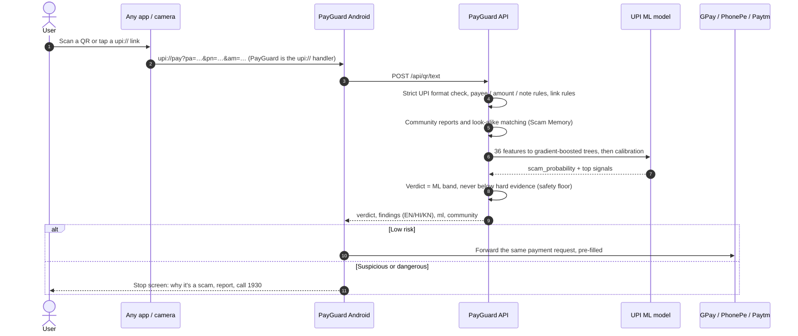

#### B. Checking an SMS (layered pipeline)

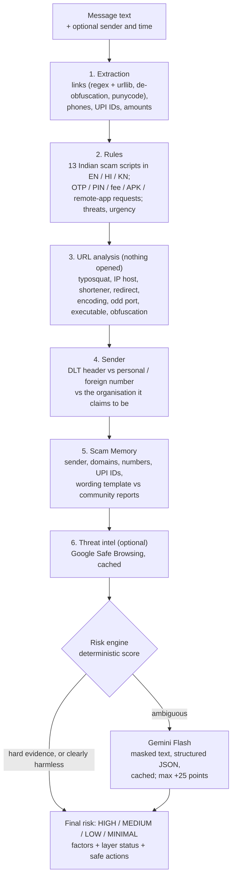

#### C. Verifying a payment screenshot

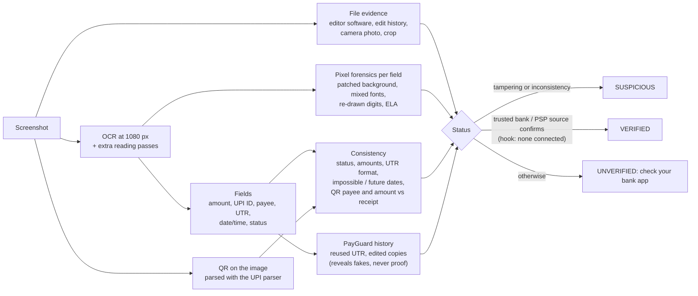

#### D. Checking an APK

`upload (streamed, size-capped)` → zip-bomb and entry checks → unwrap `.apks` / `.xapk` → **androguard** decodes the
binary manifest (permissions, components, SDK levels) → a **custom DEX reader** collects every string and referenced API
method in milliseconds → resources and assets (fake CVV/PIN forms, hidden payloads) → signing certificate → **24 rules**
(banking-trojan triad, OTP theft, Telegram exfiltration, call forwarding, bank target lists, lure mismatch, brand
impersonation…) → score 0–100 → optional Gemini explanation of the facts (never the file) → report cached by SHA-256,
APK bytes deleted. The analysis runs in a short-lived **spawn worker** so a hostile file can't exhaust the server.

### Documentation links

| Document | What's in it |
|---|---|
| **[Swagger UI](https://payguard-api-9w9d.onrender.com/docs)** · [ReDoc](https://payguard-api-9w9d.onrender.com/redoc) | Interactive API docs generated from the code |
| **[`docs/openapi.json`](docs/openapi.json)** | OpenAPI 3.1 specification (regenerate: see [Testing & QA](#testing--qa-commands)) |
| **[`docs/FEATURES.md`](docs/FEATURES.md)** | Deep reference: every rule, the QR / APK rule tables, complaints, family mode, trends, PWA install |
| [`app/ml/MODEL_CARD.md`](app/ml/MODEL_CARD.md) | UPI ML model: features, synthetic dataset, metrics, calibration, limitations |
| [`android-upi-intercept/README-UPI-INTENT.md`](android-upi-intercept/README-UPI-INTENT.md) | Android app: building, installing, `upi://` interception, demo script |
| [`HACKATHON.md`](HACKATHON.md) | What existed before the event (git tag `pre-hackathon`) vs what was built during it |
| [`SECURITY.md`](SECURITY.md) · [`CONTRIBUTING.md`](CONTRIBUTING.md) · [`THIRD_PARTY_NOTICES.md`](THIRD_PARTY_NOTICES.md) | Security policy, contribution guide, credits |

---

## 3. Installation & configuration

### Prerequisites & tech stack

| Requirement | Version / bound | Needed for |
|---|---|---|
| **Python** | **3.11** (tested in CI; the Docker image uses `python:3.11-slim`) | Server |
| pip + venv | recent | Installing dependencies |
| **Tesseract OCR** | 5.x, *optional* | Screenshot OCR fallback / low-memory engine (`OCR_ENGINE=tesseract`); RapidOCR ships with pip and works offline |
| eSpeak NG | *optional* | Server-side read-aloud fallback (`/api/tts`); phones use their own voice first |
| Docker | 24+ *(optional)* | One-command container run / deployment |
| **JDK 17** + Android SDK 34 | Gradle wrapper included | Building the Android app (min Android 7.0 / API 24) |
| Hardware | **No GPU.** Server fits in **512 MB RAM** (Render free); ~1 GB recommended with RapidOCR | |
| Node.js | **not required** | The frontend is plain JS with no build step |

**Stack.**

| Layer | Technologies |
|---|---|
| Backend | FastAPI, Uvicorn, Pydantic, httpx (async), SQLite, optional Postgres via psycopg 3 |
| Analysis | androguard 4 + custom DEX reader, OpenCV (QR decode, image forensics), NumPy, RapidOCR (ONNX Runtime) / Tesseract, Pillow |
| ML | Gradient-boosted trees trained with scikit-learn, served by a pure-Python runtime (no scikit-learn at runtime), isotonic calibration |
| AI & threat intel | Google Gemini Flash (REST, JSON-schema output), Google Safe Browsing v4, VirusTotal (optional) |
| Frontend | Vanilla JS + CSS, PWA (service worker, share target), Lenis smooth scroll, BarcodeDetector / jsQR camera scanning |
| Android | Java, framework widgets, Google Code Scanner, `upi://` intent handling, JobScheduler alerts |
| Auth, mail & push | Clerk, Brevo / Resend / SMTP, Web Push (own VAPID + aes128gcm implementation) |
| Documents | ReportLab (evidence PDF), qrcode |
| Ops | Docker, Render blueprint (`render.yaml`), GitHub Actions (tests + lint + coverage, signed Android release) |

### Step-by-step installation

**1. Clone and install**

```bash
git clone https://github.com/paulnimisha11-png/payguard-latest.git
cd payguard-latest
python3.11 -m venv .venv && source .venv/bin/activate      # Windows: .venv\Scripts\activate
pip install --upgrade pip
pip install -r requirements.txt
```

**2. (Optional) system tools.** Only needed for the Tesseract engine and server read-aloud.

```bash
sudo apt-get install -y tesseract-ocr espeak-ng        # Debian / Ubuntu
brew install tesseract espeak-ng                       # macOS
```

**3. Configure (optional).** Everything works with no configuration. To enable AI, threat intel, sign-in and e-mail:

```bash
cp .env.example .env        # then fill in only the keys you need; .env is git-ignored
```

**4. Run**

```bash
uvicorn app.main:app --reload --port 8000
```

Open **http://localhost:8000** (landing) or **http://localhost:8000/app** (scanner), and try the files in `samples/`:

| Try this | Expected |
|---|---|
| `samples/Courier_Delivery_Update.apk` (inert fixture we built) | **100 / 100: Do NOT install** |
| `samples/qr/scam_refund_upi.png` | **Do NOT pay**, ML ≈ 97% scam |
| `samples/qr/genuine_shop_upi.png` | **Low risk**, "Pay with your UPI app" |
| `samples/screenshots/fake_edited_amount.png` / `genuine_receipt.png` | **SUSPICIOUS** / **UNVERIFIED** |
| Message: *"Your SBI account will be blocked today. Update KYC at http://sbi-kyc-update.xyz/login and share the OTP"* | **HIGH RISK** |

**5. Docker (alternative)**

```bash
docker build -t payguard .
docker run -p 8000:8000 -v payguard-data:/data --env-file .env payguard
```

**6. Deploy.** On Render: *New → Blueprint →* this repository (`render.yaml`), then add secrets in the dashboard.
Any Docker host works; the image respects `$PORT`.

**7. Android app**

```bash
cd android-upi-intercept
./gradlew assembleDebug                 # app/build/outputs/apk/debug/app-debug.apk
./gradlew installDebug                  # or install straight onto a USB-connected phone
```

Or download the CI-built, signed **[PayGuard.apk](https://github.com/paulnimisha11-png/payguard-latest/releases/tag/android-latest)**.
In the app, point *Settings → Server* at your deployment (or scan the QR at `/api/app/connect.png`).

**8. Optional: demo data and model retraining**

```bash
python scripts/seed_demo.py                 # clearly labelled demo data for /trends  (--remove to delete)
pip install -r requirements-ml.txt          # scikit-learn, only for training
python scripts/make_upi_dataset.py && python scripts/train_upi_model.py
```

### Environment variables matrix

All variables are **optional**; with none set, every scanner works locally. Secrets are read on the server only. The
full template is [`.env.example`](.env.example).

**AI & threat intelligence**

| Key | Description | Type | Default | Required |
|---|---|---|---|---|
| `GEMINI_API_KEY` | Enables the APK AI analyst and the SMS AI reading (ambiguous messages only). **Secret** | string | *(unset = AI off)* | No |
| `GEMINI_MODEL` | Primary Gemini model | string | `gemini-3.8-flash` | No |
| `GEMINI_FALLBACK_MODELS` | Tried in order on HTTP 429 / 5xx / 404 | CSV | `gemini-3.6-flash,gemini-3.5-flash-lite` | No |
| `GEMINI_TIMEOUT` | Total budget for the APK explanation | seconds (float) | `25` | No |
| `GEMINI_SMS_TIMEOUT` | Total budget for the SMS AI reading | seconds (float) | `12` | No |
| `SAFE_BROWSING_API_KEY` | Google Safe Browsing v4 lookups for links in messages. **Secret** | string | *(unset = "not configured")* | No |
| `SAFE_BROWSING_TIMEOUT` | Safe Browsing request timeout | seconds (float) | `4` | No |
| `VT_API_KEY` | VirusTotal hash lookup for APKs. **Secret** | string | *(unset)* | No |
| `ANTHROPIC_API_KEY` | Natural-language "send to family" messages. **Secret** | string | *(unset = templates)* | No |
| `ANTHROPIC_MODEL` | Model for those messages | string | `claude-haiku-4-5-20251001` | No |

**Server, storage & limits**

| Key | Description | Type | Default | Required |
|---|---|---|---|---|
| `PORT` | Port used by the Docker image | int | `8000` | No |
| `APKXRAY_DB` | SQLite file (reports, votes, trends, family, caches) | path | `data/apkxray.db` (`/data/apkxray.db` in Docker) | No |
| `APKXRAY_MAX_MB` | Max APK upload size | int (MB) | `150` | No |
| `APKXRAY_TIMEOUT` | Max APK analysis time | int (s) | `120` | No |
| `APKXRAY_RATE_PER_MIN` | Scans per IP per minute | int | `12` | No |
| `APKXRAY_WORKERS` | APK worker processes | int | `1` | No |
| `OCR_ENGINE` | `rapidocr` or `tesseract` (lower memory) | enum | auto (RapidOCR, Tesseract fallback) | No |
| `APKXRAY_OCR_CONCURRENCY` | Screenshots OCR'd at once | int | `1` | No |
| `APKXRAY_OCR_STRIP` | RapidOCR strip height (memory vs speed) | int (px) | `1100` | No |
| `PAYGUARD_UPI_MODEL` | Path to an alternative trained UPI model | path | `app/ml/upi_model.json` | No |

**Community, moderation & family**

| Key | Description | Type | Default | Required |
|---|---|---|---|---|
| `APKXRAY_VOTE_SALT` | Salt for hashing reporter devices and networks. **Set a long random value in production** | string | `payguard-votes` | Prod: **Yes** |
| `APKXRAY_PUBLIC_MIN` | Independent reports before an identifier is public on `/trends` | int | `3` | No |
| `APKXRAY_ADMIN_TOKEN` | Enables `/admin.html` moderation. **Secret** | string | *(unset = disabled)* | No |
| `APKXRAY_COMPLAINT_TTL_DAYS` | Days before complaints auto-delete | int | `30` | No |
| `APKXRAY_VAPID_PRIVATE` | Web Push private key (PEM). **Secret** | PEM string | auto-generated into `data/` | No |
| `APKXRAY_VAPID_SUB` | Web Push contact | `mailto:` URI | `mailto:payguard-alerts@example.com` | No |
| `APKXRAY_APP_APK_URL` | Where `/download/payguard.apk` redirects | URL | *(unset = local file)* | No |

**Accounts & e-mail** (only if you enable sign-in; every scanner works without an account)

| Key | Description | Type | Default | Required |
|---|---|---|---|---|
| `PUBLIC_URL` | This site's origin; Clerk tokens must be issued for it | URL | request origin | For sign-in: **Yes** |
| `CLERK_PUBLISHABLE_KEY` | Clerk publishable key (public) | string | *(unset = sign-in off)* | For sign-in: **Yes** |
| `CLERK_SECRET_KEY` | Clerk secret key. **Secret, server only** | string | *(unset)* | For sign-in: **Yes** |
| `CLERK_JWT_KEY` | JWKS public key for offline token verification | PEM string | *(unset)* | No |
| `CLERK_AUTHORIZED_PARTIES` | Extra accepted origins (e.g. `http://localhost:8000`) | CSV | *(unset)* | No |
| `DATABASE_URL` | Postgres for accounts (e.g. Supabase pooler) | URL | *(unset = SQLite)* | On ephemeral hosts |
| `BREVO_API_KEY` / `RESEND_API_KEY` | HTTP e-mail providers. **Secret** | string | *(unset = console)* | No |
| `SMTP_HOST` / `SMTP_PORT` / `SMTP_USER` / `SMTP_PASSWORD` | SMTP alternative | string / int | `—` / `587` / `—` / `—` | No |
| `MAIL_FROM` / `MAIL_FROM_NAME` | Sender address and name | string | `no-reply@payguard.local` / `PayGuard` | No |

---

## 4. Developer experience & quality control

### Usage snippets

Every endpoint returns the same shape: a `verdict` (`score`, `level`, `headline`, `advice`), `findings` (each with
`id`, `severity`, `points`, `title`/`detail` in `en`/`hi`/`kn`, and `evidence`) plus scanner-specific blocks.

**Check a UPI link (ML + rules)**

```bash
curl -s -X POST https://payguard-api-9w9d.onrender.com/api/qr/text \
  -H 'content-type: application/json' \
  -d '{"text":"upi://pay?pa=9876501234@ybl&pn=SBI%20Refund%20Dept&am=4999&tn=Scan%20to%20receive%20your%20refund"}' \
  | jq '{level: .verdict.level, ml: .ml.scam_probability_percent, why: [.findings[].title.en]}'
```

```json
{ "level": "danger", "ml": 97.0,
  "why": ["Pretends you will RECEIVE money — but you will PAY",
          "Name looks official, but money goes to a personal account",
          "Scanning this sends ₹4,999.00 FROM your account"] }
```

**Check an SMS with its sender**

```bash
curl -s -X POST http://localhost:8000/api/message -H 'content-type: application/json' -d '{
  "text": "Dear customer your SBI account will be blocked today. Update KYC at http://sbi-kyc-update.xyz/login and share the OTP",
  "sender": "+919876543210"}' | jq '.risk | {level, score, factors: [.factors[].title.en], ai: .layers.ai.status}'
```

```json
{ "level": "HIGH", "score": 100,
  "factors": ["Asks you to share an OTP, PIN or password", "The link in this message is dangerous",
              "Matches a known scam: KYC / bank-account block scam", "Claims to be SBI but came from a personal mobile number", "…"],
  "ai": "skipped" }
```

**Verify a payment screenshot / scan an APK**

```bash
curl -s -F file=@samples/screenshots/fake_edited_amount.png http://localhost:8000/api/screenshot \
  | jq '.verification | {status, reason, fields: {amount: .fields.amount, utr: .fields.transaction_id}}'

curl -s -F file=@samples/Courier_Delivery_Update.apk http://localhost:8000/api/scan \
  | jq '{score: .verdict.score, level: .verdict.level, top: .findings[0].title.en}'
```

**From Python**

```python
import httpx

r = httpx.post("http://localhost:8000/api/message",
               json={"text": "Your parcel is on hold, pay Rs 25 fee: hxxps://indiapost-track[.]top/pay",
                     "sender": "+447911123456", "use_ai": True}).json()
print(r["risk"]["level"])                         # HIGH
for f in r["risk"]["factors"]:
    print(f"[{f['layer']}] {f['title']['en']}")   # rules / url / sender / memory / threat_intel / ai
print({k: v["status"] for k, v in r["risk"]["layers"].items()})
```

**Main endpoints** (full list in the [OpenAPI spec](docs/openapi.json))

| Method | Path | Purpose |
|---|---|---|
| `POST` | `/api/qr/text` · `/api/qr/image` | UPI / web link or QR image → verdict, `ml`, `community` |
| `POST` | `/api/message` | SMS / WhatsApp text (+ `sender`, `received_at`, `use_ai`) → verdict + `risk` |
| `POST` | `/api/screenshot` | Payment screenshot (+ `expected_amount`, `bank_sms`) → verdict + `verification` |
| `POST` | `/api/scan` | APK upload → full X-Ray report (+ optional `ai`) |
| `GET` | `/api/report/{sha256}` · `/api/screenshot/{sha256}` | Cached reports (shareable pages `/r/…`, `/s/…`) |
| `POST` | `/api/reports` | Community report: `got_me`, `fake` or `not_scam` |
| `POST` / `GET` | `/api/complaints` · `/api/complaints/{ref}[/pdf]` | Complaint builder and evidence PDF (token-protected) |
| `GET` | `/api/trends` · `/api/lookup?q=` | Public scam radar · "has this ID / number / site been reported?" |
| `*` | `/api/family/*` | Guardian pairing, alerts, Web Push |
| `GET` | `/api/health` | Engine version, OCR engine, ML model, AI / threat-intel status and last outcome |

### Testing & QA commands

```bash
# everything CI runs (GitHub Actions: .github/workflows/backend.yml)
ruff check app scripts tests                              # static analysis: syntax errors, undefined names, unused code
python -m pytest -q tests                                 # 238 tests; each run uses its own temporary database
python -m pytest -q --cov=app --cov-report=term tests     # coverage (86% of app/ at the time of writing)

# focused suites
python -m pytest -q tests/test_sms_pipeline.py            # SMS layers, Gemini / Safe Browsing mocked (success, 503, timeout, garbage)
python -m pytest -q tests/test_qr.py tests/test_qr_ml.py  # UPI parsing, strict format, ML shape, safety floor, calibration
python -m pytest -q tests/test_screenshot*.py             # forensics on synthetic receipts, per installed OCR engine
OCR_ENGINE=tesseract python -m pytest -q tests/test_screenshot_verify.py   # same checks on the production OCR engine

# API contract
python -c "import json; from app.main import app; json.dump(app.openapi(), open('docs/openapi.json','w'), indent=1)"

# Android (CI: .github/workflows/android.yml builds and signs a release APK)
cd android-upi-intercept && ./gradlew assembleDebug
```

**What the test suite covers**

| Suite | Tests | Highlights |
|---|---:|---|
| `test_qr.py` | 47 | UPI pay / collect / mandate, malformed `upi:\pay` / `upi:/pay` never "safe", fake bank domains, `sms:` / `tel:` QR tricks |
| `test_message.py` | 41 | 22 real-world scam scripts and 14 genuine messages (OTP, bank debits) that must stay "low" |
| `test_sms_pipeline.py` | 30 | Multiple / obfuscated / IP / Unicode links, typosquats, sender spoofing, Scam Memory, duplicate-SMS cache, Gemini and Safe Browsing failures, masking |
| `test_screenshot_verify.py` | 19 | VERIFIED only with a trusted source, QR-vs-receipt mismatch, impossible dates, UTR reuse, both OCR engines |
| `test_qr_ml.py` | 18 | Probability range, calibration monotonic, safety floor, rule score never a feature, retraining on a replacement dataset |
| `test_auth.py` | 14 | Clerk token verification, sessions, same-site checks (SQLite and Postgres) |
| `test_screenshot.py` + `_pairs.py` | 25 | Edited amounts, erased digits, pending status, edited-copy vs original ordering |
| `test_reasoning.py` | 12 | Gemini request shape (metadata only), fallback chain, timeouts |
| others | 32 | APK rules, TTS, trends, family push round-trip, votes, complaints |

Quality gates on every push and pull request: **ruff → 238 tests with coverage → Android release build**.

---

## 5. Reliability, performance & security

### Benchmarks & maturity status

Measured with [`httpx`](https://www.python-httpx.org/) against a local server (`uvicorn`, 1 process) on a **2 vCPU
Intel Xeon 2.8 GHz / 7 GB** container, warm cache, loopback network, **no external API calls**. The Render free plan
has only a fraction of one CPU, so expect those times to be several times slower there.

| Operation | Endpoint | p50 | p95 | Runs |
|---|---|---:|---:|---:|
| UPI link: parse + rules + ML + community | `POST /api/qr/text` | **10 ms** | 14 ms | 30 |
| SMS: all deterministic layers (AI not needed) | `POST /api/message` | **12 ms** | 14 ms | 30 |
| QR image: OpenCV decode + checks | `POST /api/qr/image` | **87 ms** | 106 ms | 20 |
| APK X-Ray: first scan of a file | `POST /api/scan` | **0.48 s** | – | 1 |
| APK X-Ray: same file again (SHA-256 cache) | `POST /api/scan` | **14 ms** | 22 ms | 10 |
| Payment screenshot: Tesseract (production engine) | `POST /api/screenshot` | **4.4 s** | 4.7 s | 5 |
| Payment screenshot: RapidOCR (higher accuracy) | `POST /api/screenshot` | **7.2 s** | 7.6 s | 5 |

| Resource | Measured |
|---|---|
| Server memory, idle | ≈ 225 MB RSS |
| Peak during a screenshot check | ≈ 300 MB (Tesseract) · ≈ 500 MB (RapidOCR) |
| Fits Render free (512 MB) | **Yes**, with `OCR_ENGINE=tesseract` and one OCR job at a time (both set in `render.yaml` / Dockerfile) |
| ML model at runtime | < 1 MB JSON, pure Python, ≈ 3 ms per prediction; no scikit-learn needed to serve |
| Gemini cost control | Called only for ambiguous messages; identical (masked) messages answered from cache; ≤ 700 characters sent |

**Scalability.** The API is stateless apart from the database, so it scales horizontally behind a load balancer once
SQLite is swapped for Postgres (accounts already support `DATABASE_URL`). CPU-heavy work (APK analysis, OCR) is
isolated in worker processes and semaphores, so it can be moved to a queue without touching the API. Reports are
cached by SHA-256, so the same viral scam file or QR is analysed once.

**Maturity status.**

| Component | Status | Notes |
|---|---|---|
| QR / UPI scanner & strict UPI validation | 🟢 **Beta** | Deterministic, broad test corpus |
| SMS layered pipeline | 🟢 **Beta** | Works fully without AI / threat intel |
| APK X-Ray | 🟢 **Beta** | Static analysis only (see limitations) |
| Payment screenshot forensics | 🟡 **Beta** | VERIFIED needs a real bank / PSP integration (hook ready, none connected) |
| UPI ML model | 🟠 **Prototype** | Trained on a documented **synthetic** dataset; its metrics are not real-world accuracy ([model card](app/ml/MODEL_CARD.md)) |
| Android app | 🟢 **Beta** | Signed release built by CI |
| Community reports, trends, family, complaints | 🟢 **Beta** | SQLite resets on ephemeral hosts unless a disk / Postgres is attached |

### Troubleshooting & known limitations

**Common setup errors**

| Symptom | Cause | Fix |
|---|---|---|
| First request takes 30–60 s on the live demo | Free Render instance sleeps when idle | Wait once; later requests are fast. Paid instance or a keep-alive ping for demos |
| Screenshot result says *reduced accuracy* or *text unreadable* | No OCR engine found, or Tesseract fallback in use | `pip install -r requirements.txt` (RapidOCR) or install `tesseract-ocr`; check `/api/health` → `ocr_engine` |
| Server killed / out of memory on a 512 MB host | RapidOCR peak ≈ 500 MB | `OCR_ENGINE=tesseract`, `APKXRAY_OCR_CONCURRENCY=1`, `APKXRAY_WORKERS=1` |
| Camera scanning doesn't start | Browsers only allow the camera on `https://` or `localhost` | Use the deployed https URL or a tunnel, not `http://192.168…` |
| AI card says "not available" | Gemini busy (HTTP 503) or key/model not enabled | Automatic fallback through `GEMINI_FALLBACK_MODELS`; see `/api/health` → `apk_reasoning_last` / `sms_ai_last`. Results are complete without AI |
| Threat intelligence shows "not configured" | No `SAFE_BROWSING_API_KEY` | Optional; add the key to enable |
| Sign-in loops or "token not accepted" | Clerk token issued for another origin | Set `PUBLIC_URL`; add `CLERK_AUTHORIZED_PARTIES=http://localhost:8000` for local testing |
| E-mails not sent on Render | Free plan blocks SMTP | Use `BREVO_API_KEY` or `RESEND_API_KEY` |
| Reports / trends reset after a deploy | Ephemeral disk | Attach a persistent disk for `APKXRAY_DB`; `DATABASE_URL` for accounts |
| `429 Too many requests` | Per-IP rate limit | Raise `APKXRAY_RATE_PER_MIN` for local testing |
| `Could not import module "app.main"` on deploy | `app/` overwritten or missing in the build context | Make sure `app/main.py` exists at the repository root and the Dockerfile copies `app/` |

**Known limitations & trade-offs** (we say these before judges ask)

| Area | Limitation | Why / mitigation |
|---|---|---|
| Screenshots | PayGuard **cannot confirm a payment happened**; a clean screenshot is only *UNVERIFIED* | Only the bank / payment network knows. `verify.TRUSTED_SOURCES` is the hook for a real authenticated integration; we never fake one, and PayGuard's own database is never treated as proof |
| ML model | Trained on synthetic data | No public labelled UPI-fraud dataset exists. The model is labelled *prototype*, calibrated, and bounded below by hard evidence; retrain with `--data your.csv` |
| SMS | Brand-new scam domains aren't on any list yet; redirects aren't followed; well-crafted wording can pass the rules | URL heuristics, sender and memory still apply; Gemini covers wording but is capped because it can be wrong or manipulated |
| SMS sender | Sender IDs can be spoofed; shared SMS text doesn't include the sender | The sender is a capped hint, never proof. The Android app has **no SMS permission** by design (privacy + Play policy); users can type the sender |
| APK X-Ray | Static analysis only: code downloaded after install or hidden by commercial packers isn't visible | Packers and droppers are flagged; findings show evidence so genuine SMS / accessibility apps can be judged |
| False positives / negatives | Heuristics can flag unusual but genuine links and miss novel scams | Every finding shows its evidence; community "It's genuine" disputes and moderation reduce false listings; "low risk" is never shown as "safe" |
| External APIs | Gemini / Safe Browsing / VirusTotal can be slow or down | Timeouts, fallback models, caching; each layer's status is shown and the deterministic result is always complete |
| Complaints | PayGuard can't file on cybercrime.gov.in for the user (no public API) | It pre-fills every field, the 1930 script and the evidence PDF |

### Security reporting

Please report vulnerabilities **privately** through
**[GitHub → Security → Report a vulnerability](https://github.com/paulnimisha11-png/payguard-latest/security/advisories/new)**,
never in a public issue. What to include, response times, scope and safe-harbour are in **[SECURITY.md](SECURITY.md)**.

Security & privacy design, in short:

- **Keys never leave the server.** Gemini, Safe Browsing, VirusTotal, Clerk and e-mail keys come from environment
  variables; nothing secret is in the repository, the web page or the APK (`.env` is git-ignored).
- **Data minimisation.** Message text and screenshots are not stored. Gemini gets masked text (phone numbers, UPI IDs,
  e-mail and long numbers replaced; links reduced to the website name) and instructions to treat the message as data
  (prompt-injection resistance). Safe Browsing gets link addresses only; VirusTotal gets a hash only.
- **Hostile-file handling.** APKs are never installed or executed; zip-bomb, size and entry-count checks run first;
  analysis runs in a short-lived worker process with a timeout; the file is deleted afterwards.
- **Abuse resistance.** Per-IP rate limiting; salted, hashed reporter IDs; public listing only after reports from
  several independent networks; disputes and moderation; state-changing account endpoints check same-site origin.
- **Least privilege on Android.** No SMS, contacts or storage permissions; messages arrive via the share sheet or paste.

---

## 6. Governance & license

- **License:** [MIT](LICENSE). Third-party libraries, fonts, programs and the open-source sample apps in `samples/`
  keep their own licenses and are credited in [THIRD_PARTY_NOTICES.md](THIRD_PARTY_NOTICES.md).
- **Contributing:** see [CONTRIBUTING.md](CONTRIBUTING.md): branch from `main`, keep `ruff` and all tests green, give
  every new rule EN / HI / KN text, evidence and a test, and never commit real personal data, malware or secrets.
- **Code style:** Python 3.11 with type hints, linted by [ruff](ruff.toml); vanilla JS with no build step; Java for
  Android with strings in `values/`, `values-hi/` and `values-kn/`.
- **Hackathon transparency:** [HACKATHON.md](HACKATHON.md) lists what existed before ASYNC'26 (git tag
  `pre-hackathon`) and what was built during the event.
- **AI assistance:** parts of the code were written with an AI coding assistant (Anthropic's Claude); the team
  reviewed, tested and is responsible for it.

<details>
<summary><b>Project structure</b></summary>

```
app/
  main.py                FastAPI app: routes, uploads, rate limit, _after_check, pages
  analyzer/              APK X-Ray: core pipeline, DEX reader, 24 rules, knowledge base, spawn worker
  qr/                    QR decode + strict UPI parser + link rules
  ml/                    UPI scam model: features, pure-Python runtime, trained model, MODEL_CARD
  screenshot/            OCR, forensics, verify.py (VERIFIED / SUSPICIOUS / UNVERIFIED)
  message/               SMS pipeline: urlextract, urlcheck, sender, memory, threatintel, ai, risk, pipeline
  complaints/            complaint builder, evidence PDF, community reports
  family/                guardian pairing, alerts, Web Push
  auth/                  Clerk sign-in, accounts DB, e-mail
  reasoning.py           shared Gemini client (fallback chain, JSON schema)
  store.py  trends.py    SQLite storage, public scam radar
static/                  web app, landing, trends, family, account (no build step)
android-upi-intercept/   Android app (Java)
tests/                   238 tests (+ bundled fonts for synthetic receipts)
samples/                 demo APK fixture, QR codes, screenshots
scripts/                 demo data, ML dataset + training
docs/                    FEATURES.md, openapi.json, media/
```
</details>

<div align="center">
<br/>

**PayGuard: take a pause before you pay.**

If PayGuard would have stopped a scam you've seen, ⭐ the repo and try the [live demo](https://payguard-api-9w9d.onrender.com).

</div>
